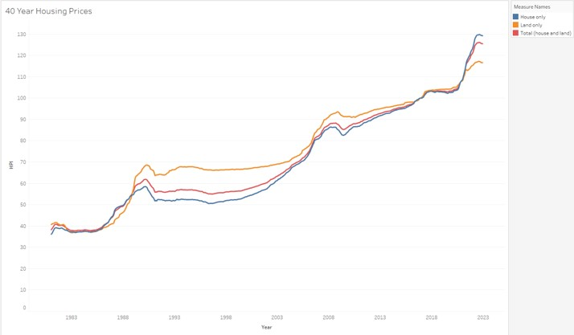
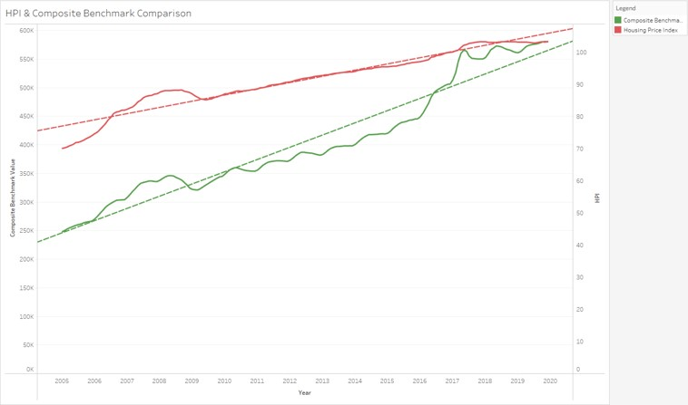
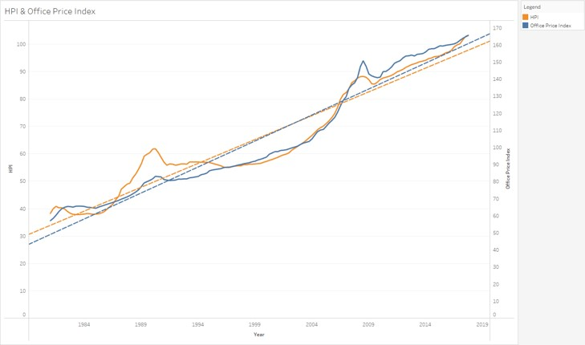
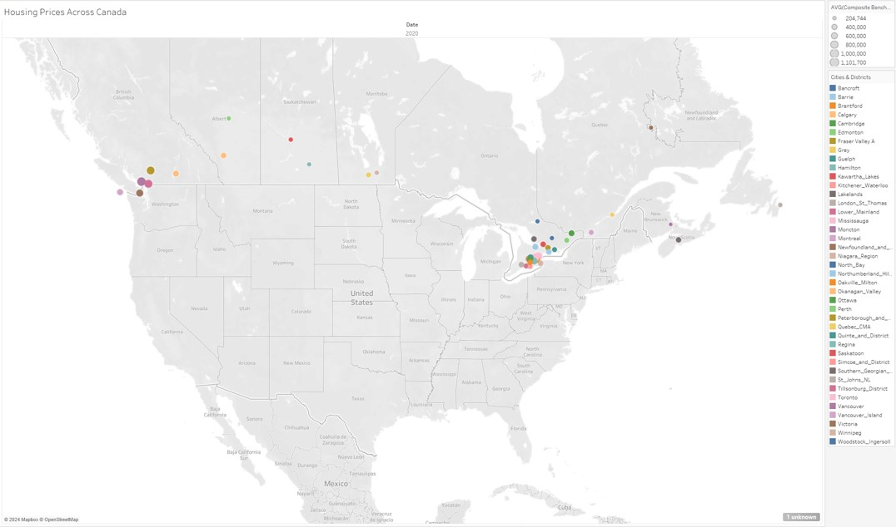
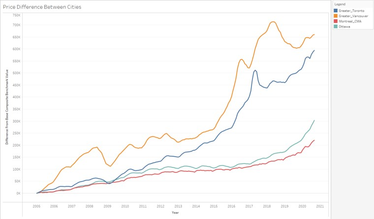
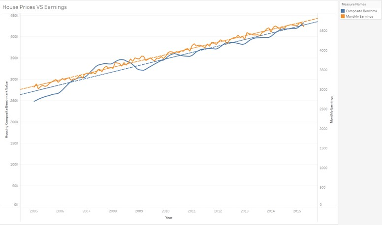
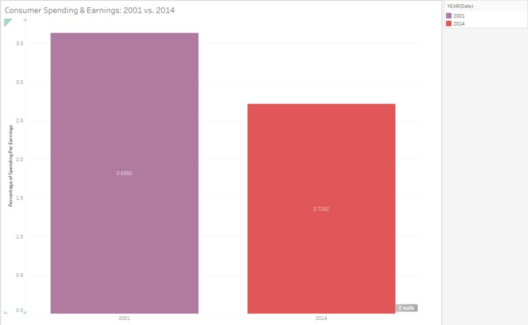
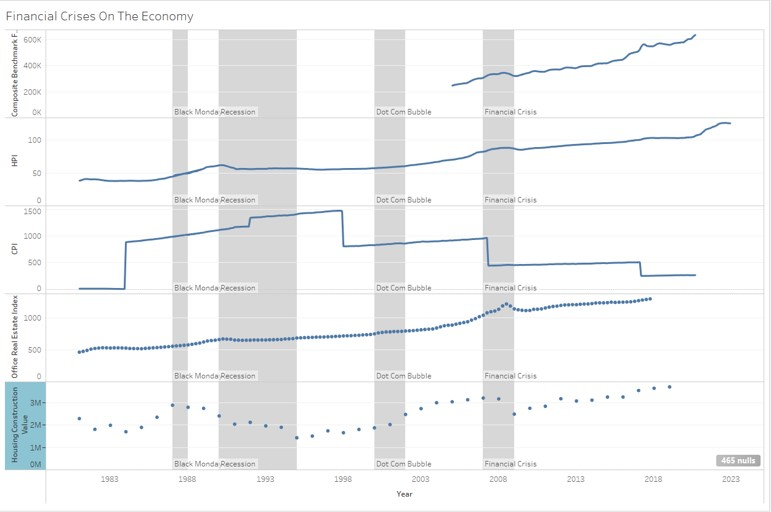

# Final-Project-Tableau

## Project/Goals
Answering qestions from option 1 using tableau to create visualization

## Process
Data Acquisition: Obtaining the data from the provided dataset
Data analysis: Getting familiar with each datasets
Data Visualization: Making the appropriate visualization using Tableau

## Results
### Trend of house prices across Canada in the last 40 years

### Comparison of Index housing prices VS actual benchmark prices

### Compare housing trend with the trend of office prices

### Overview of Canadian house prices by districts

### Are the price differences between different districts increasing?

### Compare the trend of house prices with earnings

### Did people spend more of their earnings in 2014 than they did in 2001?

### Impact of economical crises

## Challenges 
Technical issues: It is challenging still to navigate a new tool in Tableau 

Cleaning the data: the dataset has some messy data that needed cleaning 

## Future Goals
Clean the data further and also improve on Tableau skills to make better looking visuals
